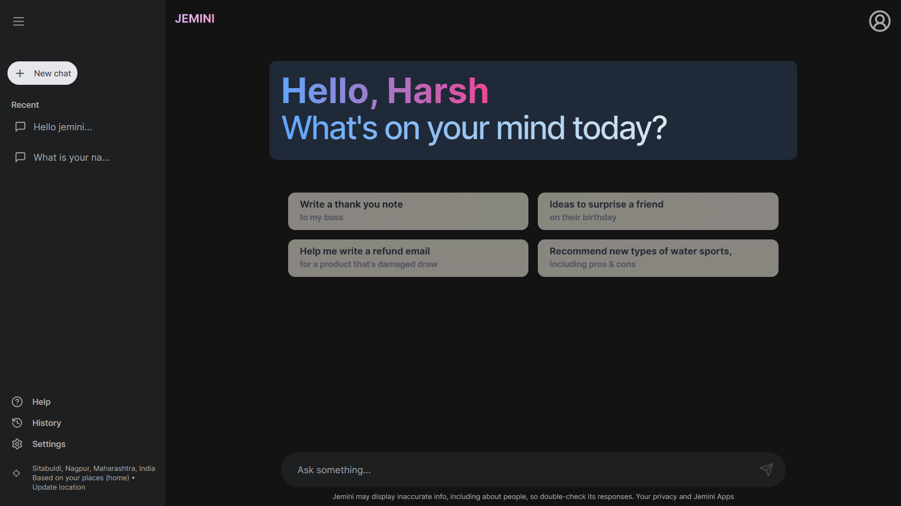
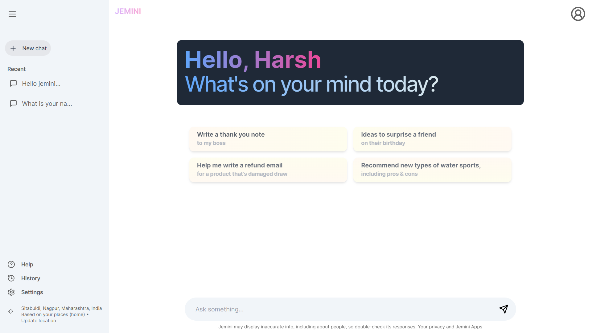
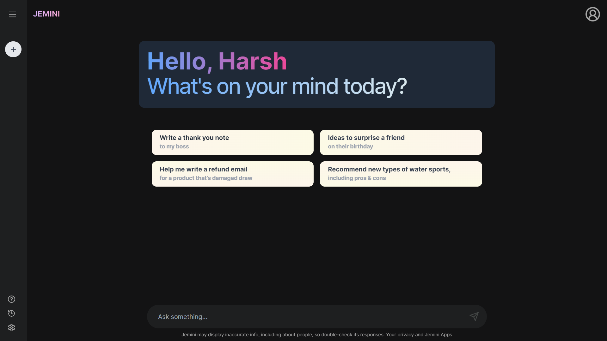
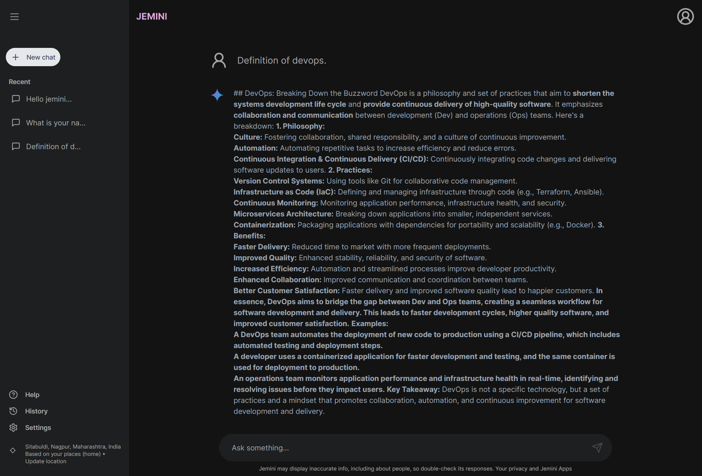

# JEMINI-AI

**JEMINI-AI** is a large language model inspired by ChatGPT and Gemini AI, capable of engaging in conversations, generating different creative text formats, and answering your questions in an informative way.

## Preview






## Getting Started

First, run the development server:

```bash
npm run dev
# or
yarn dev
# or
pnpm dev
# or
bun dev
```

Open [http://localhost:3000](http://localhost:3000) with your browser to see the result.

You can start editing the page by modifying `app/page.js`. The page auto-updates as you edit the file.

This project uses [`next/font`](https://nextjs.org/docs/basic-features/font-optimization) to automatically optimize and load Inter, a custom Google Font.

